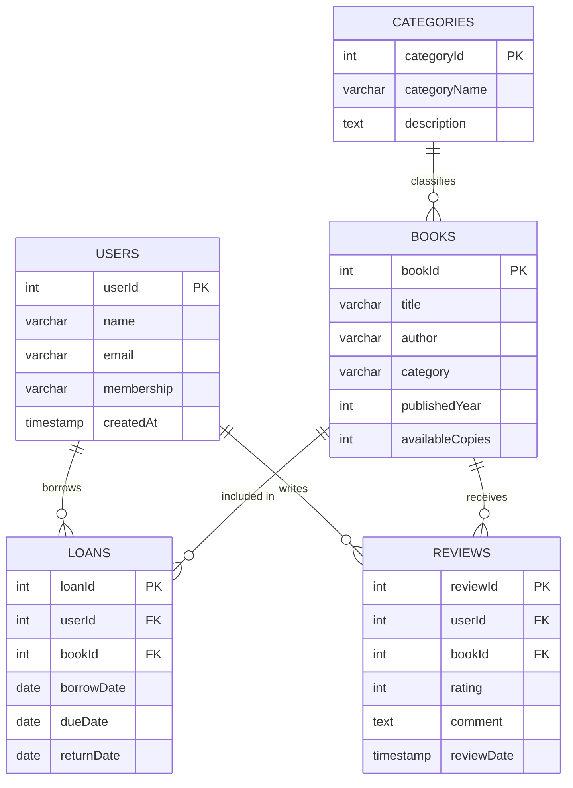

# Task 4: NoSQL Concepts and Scalability

## 1. Project Introduction

This task explores modern alternatives to traditional relational databases for handling unstructured data and large-scale expansion. The company already uses SQL, but the assignment specifically asks to compare that relational model with NoSQL and show how NoSQL can support the system in real scenarios.

### Scenario and objectives
- Introduce the types of NoSQL databases.
- Explain the purpose and core features of common NoSQL tools.
- Use a practical example to show a NoSQL database model.
- Show a specific real-world use case for NoSQL tools.
- Analyze the trade-offs of NoSQL vs relational databases in scalability, consistency, and performance.

---

## 2. Why choose NoSQL when the system also uses SQL?

Even though the project is built on SQL, this task requires exploring NoSQL because:
- The assignment wants a comparison and a separate NoSQL part.
- NoSQL can solve use cases that are harder in SQL, such as very large data volumes, flexible document structures, and cache-based performance.
- In a real system, SQL and NoSQL often work together: SQL for structured relational data, and NoSQL for fast caching, logs, or document storage.

---

## 3. Types of NoSQL Databases

| Type | Description | Common Use Cases |
|------|-------------|-----------------|
| **Key-Value** | Stores data as key/value pairs. Key is unique, value can be simple or complex. | Caching, sessions, simple lookups |
| **Document** | Stores data as JSON/BSON documents. Each document can have different fields and nested structures. | Catalogs, user profiles, content management |
| **Column-Family** | Stores data in column families instead of rows. Optimized for wide tables and fast column reads. | Event logs, time-series data, analytics |
| **Graph** | Stores entities as nodes and relationships as edges. Ideal for complex relationship queries. | Social networks, recommendation engines, fraud detection |

---

## 4. Core Features of Common NoSQL Tools

### Redis
- **Type:** Key-value store
- Extremely fast — data is stored in memory (RAM)
- Supports expiration, counters, sets, and sorted sets
- Ideal for caching, session management, and real-time counters

### Apache Cassandra
- **Type:** Column-family database
- Designed for horizontal scalability across many nodes
- High availability with no single point of failure
- Tunable consistency and strong write performance

### CouchDB
- **Type:** Document database
- Stores JSON documents with flexible structure
- Syncs data between servers and clients
- Uses HTTP API — easy to integrate with web apps

---

## 5. Database Design — ERD (Entity Relationship Diagram)

### 5.1 Relational ERD Diagram



### 5.2 ERD Explanation

| Table | Primary Key | Foreign Keys | Description |
|-------|-------------|--------------|-------------|
| USERS | userId | — | Stores library members |
| BOOKS | bookId | categoryId → CATEGORIES | Stores all books |
| LOANS | loanId | userId → USERS, bookId → BOOKS | Tracks book borrowing |
| CATEGORIES | categoryId | — | Book classification |
| REVIEWS | reviewId | userId → USERS, bookId → BOOKS | User ratings and comments |

### 5.3 Relationships Summary

- One **User** can have many **Loans** (1 to many)
- One **Book** can appear in many **Loans** (1 to many)
- One **User** can write many **Reviews** (1 to many)
- One **Book** can receive many **Reviews** (1 to many)
- One **Category** can classify many **Books** (1 to many)

---

## 6. Practical NoSQL Document Model

### Use case: Library management system (MongoDB-style)

#### Book document
```json
{
  "_id": "book123",
  "title": "Learn Programming",
  "author": "Ahmed",
  "category": "Education",
  "publishedYear": 2024,
  "tags": ["programming", "education", "web"],
  "availableCopies": 5,
  "reviews": [
    {
      "userId": "user789",
      "rating": 5,
      "comment": "Very helpful."
    }
  ]
}
```

#### User document
```json
{
  "_id": "user456",
  "name": "Ali",
  "email": "ali@example.com",
  "membership": "premium",
  "borrowedBooks": [
    {
      "bookId": "book123",
      "borrowDate": "2026-04-10",
      "dueDate": "2026-04-20"
    }
  ]
}
```

### Why this document model works
- Stores related information together in one document (no joins needed)
- Easier to extend with new fields like `reviews` or `tags`
- No schema migration needed for document changes
- Good for systems where each entity has different attributes

---

## 7. Specific NoSQL Tool Use in a Real-World Context

### Redis — Caching Layer
```
User searches for "Programming books"
  → Check Redis cache first (key: "search:programming")
  → If found: return instantly (< 1ms)
  → If not found: query SQL DB, store result in Redis with 5-min expiry
```
- Store web session data for logged-in users
- Cache search results for books to speed up response time
- Maintain counters such as book views or popular borrow counts

### Apache Cassandra — Activity Logs
```
Table: user_activity_log
  partition key: userId
  clustering key: timestamp
  → Stores millions of borrow/search events per user
  → Fast writes, scalable across many servers
```
- Store large volumes of user activity logs
- Keep borrow history and search history for many users
- Provide fast writes and scalable read performance

### CouchDB — Offline Sync
- Store books and user profiles as JSON documents
- Sync offline edits from mobile or browser clients
- Use HTTP APIs to read and update documents easily

---

## 8. NoSQL vs SQL Trade-offs Analysis

| Aspect | SQL (Relational) | NoSQL |
|--------|-----------------|-------|
| **Scalability** | Vertical (upgrade one server) | Horizontal (add more servers) |
| **Consistency** | Strong ACID transactions | Eventual consistency (faster but delayed) |
| **Schema** | Fixed schema, migrations required | Flexible schema, easy to change |
| **Performance** | Excellent for complex joins and structured queries | Excellent for high-volume reads/writes |
| **Best for** | Financial records, inventory, strict relationships | Caching, logs, flexible documents, huge data |

### When to use each
- **Use SQL** when you need strict relationships, reliable transactions, and complex queries
- **Use NoSQL** when you need flexible schema, fast caching, or huge scalable storage
- **Use both** in the same system for different purposes (polyglot persistence)

---

## 9. Task Checklist

| Requirement | Status |
|-------------|--------|
| Types of NoSQL databases (P8) | ✅ Covered in Section 3 |
| Core features of Redis, Cassandra, CouchDB (P9) | ✅ Covered in Section 4 |
| Practical NoSQL model example (M4) | ✅ Covered in Section 6 |
| Real-world NoSQL tool use (M5) | ✅ Covered in Section 7 |
| Trade-off analysis: scalability, consistency, performance (D4) | ✅ Covered in Section 8 |
| ERD with tables, keys, relationships | ✅ Covered in Section 5 |

---

## 10. Project Deliverables Summary

Include these sections in the final PDF/Word file:

- **Project Introduction** — scenario and objectives
- **Database Design** — ERD diagram (Section 5), tables, keys, relationships
- **Explanation of Concepts** — Relational DB, SQL types, NoSQL basics
- **SQL Code** — clearly written and formatted
- **Query Results** — screenshots with labels
- **Data Manipulation & Reports** — queries with explanation
- **Security Implementation** — users and permissions
- **Advanced Features** — procedures, triggers, views
- **Backup & Restore Process**
- **NoSQL Part** — document model, tool examples, trade-off analysis
